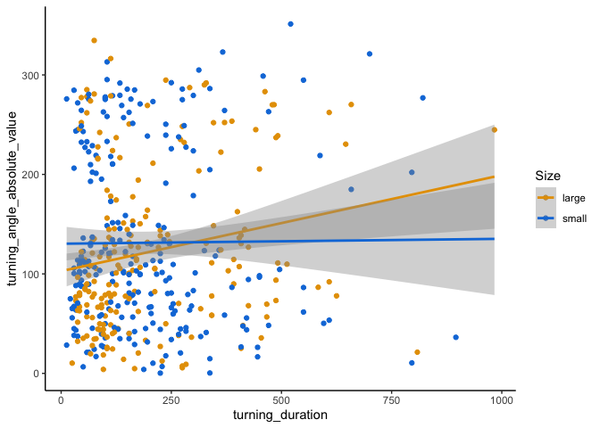

``` r
#download data

#all data
cym_dat <- read.csv("data/rawdata_allcombinedSep28.csv")

#NND data
nnd_df <- read.csv("data/rawdata_combined_NND_9.28.csv")

#spontaneous turns
spon_turn <- read.csv("data/sp_turn_10-9-23.csv")

#categorize by s and w
cym_dat$s_w_reactor <- ifelse(substr(cym_dat$responder, 1, 1) == "s", "s", "w")


wave_dat <- subset(cym_dat, substr(responder, 1, 1) == "w")

#make sure variables are as they are supposed to be

cym_dat$s_w_reactor <- as.factor(cym_dat$s_w_reactor)
cym_dat$size <- as.factor(cym_dat$size)
cym_dat$school <- as.factor(cym_dat$school)
cym_dat$stimulus <- as.factor(cym_dat$stimulus)
```

``` r
#Define thresholds for fast and slow responses for small and large

#look at averages
turnrate_result <- aggregate(turning_rate ~ size, data = spon_turn, FUN = mean)
print(turnrate_result)
```

    ##    size turning_rate
    ## 1 large    0.2243052
    ## 2 small    0.2435468

``` r
#large 0.2243052
#small 0.243546

#Mann-Whitney test
manwhit_spon <- wilcox.test(turning_rate ~ size, data = spon_turn)
print(manwhit_spon) 
```

    ## 
    ##  Wilcoxon rank sum exact test
    ## 
    ## data:  turning_rate by size
    ## W = 213, p-value = 0.6281
    ## alternative hypothesis: true location shift is not equal to 0

``` r
# p-value is less not less than 0.05, conclusion: there is no statistically significant difference in the distributions of "turning_rate" between the two size.


spon_anova <- aov(turning_rate ~ size, data = spon_turn)
print(summary(spon_anova))
```

    ##             Df Sum Sq  Mean Sq F value Pr(>F)
    ## size         1 0.0039 0.003938   0.356  0.554
    ## Residuals   42 0.4649 0.011068

``` r
plot(spon_anova)
```

<!-- --><!-- --><!-- --><!-- -->

``` r
shapiro.test(spon_anova$residuals)
```

    ## 
    ##  Shapiro-Wilk normality test
    ## 
    ## data:  spon_anova$residuals
    ## W = 0.95688, p-value = 0.09945

``` r
par(mfrow=c(2,2))
plot(spon_anova)
```

<!-- -->

``` r
#normal and homogeneity pass


#homogeneity of variances
leveneTest(turning_rate ~ size, data = spon_turn)
```

    ## Warning in leveneTest.default(y = y, group = group, ...): group coerced to
    ## factor.

    ## Levene's Test for Homogeneity of Variance (center = median)
    ##       Df F value Pr(>F)
    ## group  1  0.0169 0.8972
    ##       42

``` r
t.test(turning_rate ~ size, data = spon_turn)
```

    ## 
    ##  Welch Two Sample t-test
    ## 
    ## data:  turning_rate by size
    ## t = -0.58589, df = 34.338, p-value = 0.5618
    ## alternative hypothesis: true difference in means between group large and group small is not equal to 0
    ## 95 percent confidence interval:
    ##  -0.08596025  0.04747703
    ## sample estimates:
    ## mean in group large mean in group small 
    ##           0.2243052           0.2435468

``` r
avg_turnrate <- mean(spon_turn$turning_rate)
print(avg_turnrate)
```

    ## [1] 0.2321768

``` r
#avg turn rate is .2321768
```

``` r
#calculate turning duration on all data
# Calculate density 

cym_dat_frames <- read.csv("data/rawdata_allcombinedSep28_start_end.csv")
cym_dat_frames <- cym_dat_frames %>% 
  mutate(turning_duration = (frame_end - frame_st)/240 * 1000)

#add turning duration to cym_dat df
cym_dat$turning_duration <- cym_dat_frames$turning_duration

#calculate turning rate
cym_dat <- cym_dat %>% 
  mutate(turning_rate = turning_angle_absolute_value / turning_duration)

#categorize responses

cym_dat$response_type <- ifelse(
  (cym_dat$size == "large" & cym_dat$turning_rate > 0.22) |
  (cym_dat$size == "small" & cym_dat$turning_rate > 0.24),
  "fast",
  "slow"
)

#make sure variables are as they are supposed to be

cym_dat$s_w_reactor <- as.factor(cym_dat$s_w_reactor)
cym_dat$size <- as.factor(cym_dat$size)
cym_dat$school <- as.factor(cym_dat$school)
cym_dat$stimulus <- as.factor(cym_dat$stimulus)
cym_dat$response_type <- as.factor(cym_dat$response_type)
```

``` r
#visualize data fast and slow responses

#all together
ggplot(cym_dat,aes(x=turning_duration,y=turning_angle_absolute_value,color=size))+
         geom_point()+
         geom_smooth(method=lm,fullrange=TRUE,
                  aes(color=size))+
        scale_color_manual(name='Size',
                     breaks=c('large', 'small'),
                     values=c('large'='#E69F00', 'small'='#0C7BDC'))+
   theme(legend.title=element_text(size=14),
       legend.text=element_text(size=14))+
         theme_classic()
```

    ## `geom_smooth()` using formula = 'y ~ x'

<!-- -->

``` r
#visualize percent slow
summary_table <- cym_dat %>%
  group_by(size, response_type) %>%
  summarise(count = n()) %>%
  mutate(percentage = count / sum(count) * 100)
```

    ## `summarise()` has grouped output by 'size'. You can override using the
    ## `.groups` argument.

``` r
ggplot(summary_table, aes(x = size, y = percentage, fill = response_type)) +
  geom_bar(stat = "identity", position = "dodge") +
  labs(title = "Percentage of Fast and Slow Responses by Size Group", y = "Percentage") +
  scale_fill_fish_d(option = "Trimma_lantana") +
  theme_minimal()
```

<!-- -->

``` r
#frequency of fast and slow
summary_table <- cym_dat %>%
  group_by(size, response_type) %>%
  summarise(count = n())
```

    ## `summarise()` has grouped output by 'size'. You can override using the
    ## `.groups` argument.

``` r
ggplot(summary_table, aes(x = size, y = count, fill = response_type)) +
  geom_bar(stat = "identity", position = "dodge") +
  labs(title = "Frequency of Fast and Slow Responses by Size Group", y = "Frequency") +
  scale_fill_fish_d(option = "Trimma_lantana") +
  theme_minimal()
```

<!-- -->

``` r
#scatter plot grouped by fast and slow

ggplot(cym_dat,aes(x=turning_duration,y=turning_angle_absolute_value,color=response_type))+
         geom_point()+
         geom_smooth(method=lm,fullrange=TRUE,
                  aes(color=response_type))+
        scale_color_manual(name='Response Type',
                     breaks=c('fast', 'slow'),
                     values=c('large'='#E69F00', 'slow'='#0C7BDC'))+
   theme(legend.title=element_text(size=14),
       legend.text=element_text(size=14))+
         theme_classic()
```

    ## `geom_smooth()` using formula = 'y ~ x'

<!-- -->

``` r
# Calculating NND for each responder within the same school and stimulus group
#NAs come from two having the same nearest neighbor distance

nnd_df <- nnd_df %>%
  group_by(school, stimulus) %>%
  mutate(
    NND = sqrt((s_head_x - lag(s_head_x))^2 + (s_head_y - lag(s_head_y))^2)
  ) %>%
  ungroup()

#If we want:
# Replace NA values in the NND column with 0 
#nnd_df$NND[is.na(nnd_df$NND)] <- 0

cym_dat$NND <- nnd_df$NND

#add nnd to wave df
nnd_wave_dat <- merge(wave_dat, nnd_df[, c('school', 'stimulus', 'responder', 'NND')], 
                         by = c('school', 'stimulus', 'responder'), 
                         all.x = TRUE)

#average NND 
avgNND_result <- aggregate(NND ~ size, data = cym_dat, FUN = function(x) mean(x, na.rm = TRUE))
print(avgNND_result)
```

    ##    size      NND
    ## 1 large 19.66457
    ## 2 small 13.98682

``` r
manwhit_NND <- wilcox.test(NND ~ size, data = cym_dat)
print(manwhit_NND) 
```

    ## 
    ##  Wilcoxon rank sum test with continuity correction
    ## 
    ## data:  NND by size
    ## W = 31680, p-value = 1.444e-09
    ## alternative hypothesis: true location shift is not equal to 0

``` r
#they are significantly different from each other and further apart!  

boxplot(NND ~ size, data = cym_dat, main = "Boxplot of NND by Size",
        xlab = "Size", ylab = "NND")
```

<!-- -->

``` r
#ANCOVA
ancova_mod <- aov(turning_rate ~ size + response_type, data = cym_dat)
summary(ancova_mod)
```

    ##                Df Sum Sq Mean Sq F value   Pr(>F)    
    ## size            1   16.4   16.42    6.93  0.00877 ** 
    ## response_type   1  109.7  109.68   46.28 3.27e-11 ***
    ## Residuals     450 1066.4    2.37                     
    ## ---
    ## Signif. codes:  0 '***' 0.001 '**' 0.01 '*' 0.05 '.' 0.1 ' ' 1

``` r
par(mfrow=c(2,2))
plot(ancova_mod)
```

<!-- -->

``` r
wilcox.test(turning_rate ~ response_type, data = cym_dat)
```

    ## 
    ##  Wilcoxon rank sum test with continuity correction
    ## 
    ## data:  turning_rate by response_type
    ## W = 28341, p-value < 2.2e-16
    ## alternative hypothesis: true location shift is not equal to 0

``` r
# p-value <2.2e-16, conclusion: there is a statistically significant difference in the distributions of "turning_rate" between the two response types.
```

``` r
#Only interested in fast responses, making new dataset excluding slow responses

fast_dat <- cym_dat %>%
  filter(response_type == "fast")

#glm for fast
mod_fast <- glm(latency_ms ~ s_w_reactor + distance_from_stimulus + size+ angle_between_fish_and_stimulus + distance_from_first_responder +NND, data = fast_dat, family=poisson, na.action = na.exclude)
```

    ## Warning in dpois(y, mu, log = TRUE): non-integer x = 4.200000

    ## Warning in dpois(y, mu, log = TRUE): non-integer x = 12.500000

    ## Warning in dpois(y, mu, log = TRUE): non-integer x = 20.800000

    ## Warning in dpois(y, mu, log = TRUE): non-integer x = 20.800000

    ## Warning in dpois(y, mu, log = TRUE): non-integer x = 41.700000

    ## Warning in dpois(y, mu, log = TRUE): non-integer x = 16.700000

    ## Warning in dpois(y, mu, log = TRUE): non-integer x = 54.200000

    ## Warning in dpois(y, mu, log = TRUE): non-integer x = 41.700000

    ## Warning in dpois(y, mu, log = TRUE): non-integer x = 112.500000

    ## Warning in dpois(y, mu, log = TRUE): non-integer x = 104.200000

    ## Warning in dpois(y, mu, log = TRUE): non-integer x = 108.300000

    ## Warning in dpois(y, mu, log = TRUE): non-integer x = 141.700000

    ## Warning in dpois(y, mu, log = TRUE): non-integer x = 187.500000

    ## Warning in dpois(y, mu, log = TRUE): non-integer x = 179.200000

    ## Warning in dpois(y, mu, log = TRUE): non-integer x = 216.700000

    ## Warning in dpois(y, mu, log = TRUE): non-integer x = 195.800000

    ## Warning in dpois(y, mu, log = TRUE): non-integer x = 220.800000

    ## Warning in dpois(y, mu, log = TRUE): non-integer x = 8.300000

    ## Warning in dpois(y, mu, log = TRUE): non-integer x = 20.800000

    ## Warning in dpois(y, mu, log = TRUE): non-integer x = 33.300000

    ## Warning in dpois(y, mu, log = TRUE): non-integer x = 29.200000

    ## Warning in dpois(y, mu, log = TRUE): non-integer x = 41.700000

    ## Warning in dpois(y, mu, log = TRUE): non-integer x = 83.300000

    ## Warning in dpois(y, mu, log = TRUE): non-integer x = 70.800000

    ## Warning in dpois(y, mu, log = TRUE): non-integer x = 104.200000

    ## Warning in dpois(y, mu, log = TRUE): non-integer x = 112.500000

    ## Warning in dpois(y, mu, log = TRUE): non-integer x = 91.700000

    ## Warning in dpois(y, mu, log = TRUE): non-integer x = 195.800000

    ## Warning in dpois(y, mu, log = TRUE): non-integer x = 191.700000

    ## Warning in dpois(y, mu, log = TRUE): non-integer x = 241.700000

    ## Warning in dpois(y, mu, log = TRUE): non-integer x = 308.300000

    ## Warning in dpois(y, mu, log = TRUE): non-integer x = 237.500000

    ## Warning in dpois(y, mu, log = TRUE): non-integer x = 483.300000

    ## Warning in dpois(y, mu, log = TRUE): non-integer x = 987.500000

    ## Warning in dpois(y, mu, log = TRUE): non-integer x = 379.200000

    ## Warning in dpois(y, mu, log = TRUE): non-integer x = 233.300000

    ## Warning in dpois(y, mu, log = TRUE): non-integer x = 233.300000

    ## Warning in dpois(y, mu, log = TRUE): non-integer x = 291.700000

    ## Warning in dpois(y, mu, log = TRUE): non-integer x = 308.300000

    ## Warning in dpois(y, mu, log = TRUE): non-integer x = 433.300000

    ## Warning in dpois(y, mu, log = TRUE): non-integer x = 504.200000

    ## Warning in dpois(y, mu, log = TRUE): non-integer x = 295.800000

    ## Warning in dpois(y, mu, log = TRUE): non-integer x = 133.300000

    ## Warning in dpois(y, mu, log = TRUE): non-integer x = 287.500000

    ## Warning in dpois(y, mu, log = TRUE): non-integer x = 420.800000

    ## Warning in dpois(y, mu, log = TRUE): non-integer x = 458.300000

    ## Warning in dpois(y, mu, log = TRUE): non-integer x = 470.800000

    ## Warning in dpois(y, mu, log = TRUE): non-integer x = 508.300000

    ## Warning in dpois(y, mu, log = TRUE): non-integer x = 658.300000

    ## Warning in dpois(y, mu, log = TRUE): non-integer x = 495.800000

    ## Warning in dpois(y, mu, log = TRUE): non-integer x = 8.300000

    ## Warning in dpois(y, mu, log = TRUE): non-integer x = 37.500000

    ## Warning in dpois(y, mu, log = TRUE): non-integer x = 41.700000

    ## Warning in dpois(y, mu, log = TRUE): non-integer x = 37.500000

    ## Warning in dpois(y, mu, log = TRUE): non-integer x = 45.800000

    ## Warning in dpois(y, mu, log = TRUE): non-integer x = 66.700000

    ## Warning in dpois(y, mu, log = TRUE): non-integer x = 154.200000

    ## Warning in dpois(y, mu, log = TRUE): non-integer x = 62.500000

    ## Warning in dpois(y, mu, log = TRUE): non-integer x = 112.500000

    ## Warning in dpois(y, mu, log = TRUE): non-integer x = 154.200000

    ## Warning in dpois(y, mu, log = TRUE): non-integer x = 183.300000

    ## Warning in dpois(y, mu, log = TRUE): non-integer x = 195.800000

    ## Warning in dpois(y, mu, log = TRUE): non-integer x = 266.700000

    ## Warning in dpois(y, mu, log = TRUE): non-integer x = 33.300000

    ## Warning in dpois(y, mu, log = TRUE): non-integer x = 58.300000

    ## Warning in dpois(y, mu, log = TRUE): non-integer x = 133.300000

    ## Warning in dpois(y, mu, log = TRUE): non-integer x = 154.200000

    ## Warning in dpois(y, mu, log = TRUE): non-integer x = 154.200000

    ## Warning in dpois(y, mu, log = TRUE): non-integer x = 170.800000

    ## Warning in dpois(y, mu, log = TRUE): non-integer x = 241.700000

    ## Warning in dpois(y, mu, log = TRUE): non-integer x = 170.800000

    ## Warning in dpois(y, mu, log = TRUE): non-integer x = 233.300000

    ## Warning in dpois(y, mu, log = TRUE): non-integer x = 170.800000

    ## Warning in dpois(y, mu, log = TRUE): non-integer x = 212.500000

    ## Warning in dpois(y, mu, log = TRUE): non-integer x = 229.200000

    ## Warning in dpois(y, mu, log = TRUE): non-integer x = 233.300000

    ## Warning in dpois(y, mu, log = TRUE): non-integer x = 383.300000

    ## Warning in dpois(y, mu, log = TRUE): non-integer x = 12.500000

    ## Warning in dpois(y, mu, log = TRUE): non-integer x = 16.700000

    ## Warning in dpois(y, mu, log = TRUE): non-integer x = 45.800000

    ## Warning in dpois(y, mu, log = TRUE): non-integer x = 66.700000

    ## Warning in dpois(y, mu, log = TRUE): non-integer x = 87.500000

    ## Warning in dpois(y, mu, log = TRUE): non-integer x = 95.800000

    ## Warning in dpois(y, mu, log = TRUE): non-integer x = 133.300000

    ## Warning in dpois(y, mu, log = TRUE): non-integer x = 141.700000

    ## Warning in dpois(y, mu, log = TRUE): non-integer x = 137.500000

    ## Warning in dpois(y, mu, log = TRUE): non-integer x = 141.700000

    ## Warning in dpois(y, mu, log = TRUE): non-integer x = 158.300000

    ## Warning in dpois(y, mu, log = TRUE): non-integer x = 204.200000

    ## Warning in dpois(y, mu, log = TRUE): non-integer x = 320.800000

    ## Warning in dpois(y, mu, log = TRUE): non-integer x = 95.800000

    ## Warning in dpois(y, mu, log = TRUE): non-integer x = 270.800000

    ## Warning in dpois(y, mu, log = TRUE): non-integer x = 233.300000

    ## Warning in dpois(y, mu, log = TRUE): non-integer x = 241.700000

    ## Warning in dpois(y, mu, log = TRUE): non-integer x = 420.800000

    ## Warning in dpois(y, mu, log = TRUE): non-integer x = 416.700000

    ## Warning in dpois(y, mu, log = TRUE): non-integer x = 516.700000

    ## Warning in dpois(y, mu, log = TRUE): non-integer x = 29.200000

    ## Warning in dpois(y, mu, log = TRUE): non-integer x = 33.300000

    ## Warning in dpois(y, mu, log = TRUE): non-integer x = 91.700000

    ## Warning in dpois(y, mu, log = TRUE): non-integer x = 341.700000

    ## Warning in dpois(y, mu, log = TRUE): non-integer x = 395.800000

    ## Warning in dpois(y, mu, log = TRUE): non-integer x = 166.700000

    ## Warning in dpois(y, mu, log = TRUE): non-integer x = 212.500000

    ## Warning in dpois(y, mu, log = TRUE): non-integer x = 245.800000

    ## Warning in dpois(y, mu, log = TRUE): non-integer x = 262.500000

    ## Warning in dpois(y, mu, log = TRUE): non-integer x = 283.300000

    ## Warning in dpois(y, mu, log = TRUE): non-integer x = 41.700000

    ## Warning in dpois(y, mu, log = TRUE): non-integer x = 45.800000

    ## Warning in dpois(y, mu, log = TRUE): non-integer x = 116.700000

    ## Warning in dpois(y, mu, log = TRUE): non-integer x = 145.800000

    ## Warning in dpois(y, mu, log = TRUE): non-integer x = 233.300000

    ## Warning in dpois(y, mu, log = TRUE): non-integer x = 583.300000

    ## Warning in dpois(y, mu, log = TRUE): non-integer x = 170.800000

    ## Warning in dpois(y, mu, log = TRUE): non-integer x = 204.200000

    ## Warning in dpois(y, mu, log = TRUE): non-integer x = 233.300000

    ## Warning in dpois(y, mu, log = TRUE): non-integer x = 237.500000

    ## Warning in dpois(y, mu, log = TRUE): non-integer x = 241.700000

    ## Warning in dpois(y, mu, log = TRUE): non-integer x = 337.500000

    ## Warning in dpois(y, mu, log = TRUE): non-integer x = 58.300000

    ## Warning in dpois(y, mu, log = TRUE): non-integer x = 87.500000

    ## Warning in dpois(y, mu, log = TRUE): non-integer x = 116.700000

    ## Warning in dpois(y, mu, log = TRUE): non-integer x = 458.300000

    ## Warning in dpois(y, mu, log = TRUE): non-integer x = 112.500000

    ## Warning in dpois(y, mu, log = TRUE): non-integer x = 187.500000

    ## Warning in dpois(y, mu, log = TRUE): non-integer x = 187.500000

    ## Warning in dpois(y, mu, log = TRUE): non-integer x = 258.300000

    ## Warning in dpois(y, mu, log = TRUE): non-integer x = 262.500000

    ## Warning in dpois(y, mu, log = TRUE): non-integer x = 12.500000

    ## Warning in dpois(y, mu, log = TRUE): non-integer x = 12.500000

    ## Warning in dpois(y, mu, log = TRUE): non-integer x = 45.800000

    ## Warning in dpois(y, mu, log = TRUE): non-integer x = 62.500000

    ## Warning in dpois(y, mu, log = TRUE): non-integer x = 91.700000

    ## Warning in dpois(y, mu, log = TRUE): non-integer x = 162.500000

    ## Warning in dpois(y, mu, log = TRUE): non-integer x = 120.800000

    ## Warning in dpois(y, mu, log = TRUE): non-integer x = 133.300000

    ## Warning in dpois(y, mu, log = TRUE): non-integer x = 154.200000

    ## Warning in dpois(y, mu, log = TRUE): non-integer x = 162.500000

    ## Warning in dpois(y, mu, log = TRUE): non-integer x = 233.300000

    ## Warning in dpois(y, mu, log = TRUE): non-integer x = 287.500000

    ## Warning in dpois(y, mu, log = TRUE): non-integer x = 366.700000

    ## Warning in dpois(y, mu, log = TRUE): non-integer x = 370.800000

    ## Warning in dpois(y, mu, log = TRUE): non-integer x = 379.200000

    ## Warning in dpois(y, mu, log = TRUE): non-integer x = 391.700000

    ## Warning in dpois(y, mu, log = TRUE): non-integer x = 404.200000

    ## Warning in dpois(y, mu, log = TRUE): non-integer x = 29.200000

    ## Warning in dpois(y, mu, log = TRUE): non-integer x = 37.500000

    ## Warning in dpois(y, mu, log = TRUE): non-integer x = 66.700000

    ## Warning in dpois(y, mu, log = TRUE): non-integer x = 91.700000

    ## Warning in dpois(y, mu, log = TRUE): non-integer x = 91.700000

    ## Warning in dpois(y, mu, log = TRUE): non-integer x = 166.700000

    ## Warning in dpois(y, mu, log = TRUE): non-integer x = 179.200000

    ## Warning in dpois(y, mu, log = TRUE): non-integer x = 216.700000

    ## Warning in dpois(y, mu, log = TRUE): non-integer x = 229.200000

    ## Warning in dpois(y, mu, log = TRUE): non-integer x = 258.300000

    ## Warning in dpois(y, mu, log = TRUE): non-integer x = 329.200000

    ## Warning in dpois(y, mu, log = TRUE): non-integer x = 441.700000

    ## Warning in dpois(y, mu, log = TRUE): non-integer x = 483.300000

    ## Warning in dpois(y, mu, log = TRUE): non-integer x = 8.300000

    ## Warning in dpois(y, mu, log = TRUE): non-integer x = 20.800000

    ## Warning in dpois(y, mu, log = TRUE): non-integer x = 170.800000

    ## Warning in dpois(y, mu, log = TRUE): non-integer x = 179.200000

    ## Warning in dpois(y, mu, log = TRUE): non-integer x = 216.700000

    ## Warning in dpois(y, mu, log = TRUE): non-integer x = 304.200000

    ## Warning in dpois(y, mu, log = TRUE): non-integer x = 312.500000

    ## Warning in dpois(y, mu, log = TRUE): non-integer x = 341.700000

    ## Warning in dpois(y, mu, log = TRUE): non-integer x = 512.500000

    ## Warning in dpois(y, mu, log = TRUE): non-integer x = 591.700000

    ## Warning in dpois(y, mu, log = TRUE): non-integer x = 1087.500000

    ## Warning in dpois(y, mu, log = TRUE): non-integer x = 91.700000

    ## Warning in dpois(y, mu, log = TRUE): non-integer x = 104.200000

    ## Warning in dpois(y, mu, log = TRUE): non-integer x = 104.200000

    ## Warning in dpois(y, mu, log = TRUE): non-integer x = 162.500000

    ## Warning in dpois(y, mu, log = TRUE): non-integer x = 516.700000

    ## Warning in dpois(y, mu, log = TRUE): non-integer x = 283.300000

    ## Warning in dpois(y, mu, log = TRUE): non-integer x = 362.500000

    ## Warning in dpois(y, mu, log = TRUE): non-integer x = 383.300000

    ## Warning in dpois(y, mu, log = TRUE): non-integer x = 445.800000

    ## Warning in dpois(y, mu, log = TRUE): non-integer x = 454.200000

    ## Warning in dpois(y, mu, log = TRUE): non-integer x = 458.300000

    ## Warning in dpois(y, mu, log = TRUE): non-integer x = 41.700000

    ## Warning in dpois(y, mu, log = TRUE): non-integer x = 79.200000

    ## Warning in dpois(y, mu, log = TRUE): non-integer x = 141.700000

    ## Warning in dpois(y, mu, log = TRUE): non-integer x = 1391.700000

    ## Warning in dpois(y, mu, log = TRUE): non-integer x = 91.700000

    ## Warning in dpois(y, mu, log = TRUE): non-integer x = 216.700000

    ## Warning in dpois(y, mu, log = TRUE): non-integer x = 233.300000

    ## Warning in dpois(y, mu, log = TRUE): non-integer x = 308.300000

    ## Warning in dpois(y, mu, log = TRUE): non-integer x = 612.500000

    ## Warning in dpois(y, mu, log = TRUE): non-integer x = 429.200000

    ## Warning in dpois(y, mu, log = TRUE): non-integer x = 262.500000

    ## Warning in dpois(y, mu, log = TRUE): non-integer x = 8.300000

    ## Warning in dpois(y, mu, log = TRUE): non-integer x = 20.800000

    ## Warning in dpois(y, mu, log = TRUE): non-integer x = 137.500000

    ## Warning in dpois(y, mu, log = TRUE): non-integer x = 145.800000

    ## Warning in dpois(y, mu, log = TRUE): non-integer x = 204.200000

    ## Warning in dpois(y, mu, log = TRUE): non-integer x = 220.800000

    ## Warning in dpois(y, mu, log = TRUE): non-integer x = 329.200000

    ## Warning in dpois(y, mu, log = TRUE): non-integer x = 404.200000

    ## Warning in dpois(y, mu, log = TRUE): non-integer x = 1366.700000

    ## Warning in dpois(y, mu, log = TRUE): non-integer x = 283.300000

    ## Warning in dpois(y, mu, log = TRUE): non-integer x = 316.700000

    ## Warning in dpois(y, mu, log = TRUE): non-integer x = 316.700000

    ## Warning in dpois(y, mu, log = TRUE): non-integer x = 345.800000

    ## Warning in dpois(y, mu, log = TRUE): non-integer x = 570.800000

    ## Warning in dpois(y, mu, log = TRUE): non-integer x = 695.800000

    ## Warning in dpois(y, mu, log = TRUE): non-integer x = 720.800000

    ## Warning in dpois(y, mu, log = TRUE): non-integer x = 29.200000

    ## Warning in dpois(y, mu, log = TRUE): non-integer x = 29.200000

    ## Warning in dpois(y, mu, log = TRUE): non-integer x = 308.300000

    ## Warning in dpois(y, mu, log = TRUE): non-integer x = 220.800000

    ## Warning in dpois(y, mu, log = TRUE): non-integer x = 391.700000

    ## Warning in dpois(y, mu, log = TRUE): non-integer x = 512.500000

    ## Warning in dpois(y, mu, log = TRUE): non-integer x = 566.700000

    ## Warning in dpois(y, mu, log = TRUE): non-integer x = 1070.800000

    ## Warning in dpois(y, mu, log = TRUE): non-integer x = 12.500000

    ## Warning in dpois(y, mu, log = TRUE): non-integer x = 104.200000

    ## Warning in dpois(y, mu, log = TRUE): non-integer x = 329.200000

    ## Warning in dpois(y, mu, log = TRUE): non-integer x = 1679.200000

    ## Warning in dpois(y, mu, log = TRUE): non-integer x = 12.500000

    ## Warning in dpois(y, mu, log = TRUE): non-integer x = 33.300000

    ## Warning in dpois(y, mu, log = TRUE): non-integer x = 37.500000

    ## Warning in dpois(y, mu, log = TRUE): non-integer x = 41.700000

    ## Warning in dpois(y, mu, log = TRUE): non-integer x = 137.500000

    ## Warning in dpois(y, mu, log = TRUE): non-integer x = 162.500000

    ## Warning in dpois(y, mu, log = TRUE): non-integer x = 187.500000

    ## Warning in dpois(y, mu, log = TRUE): non-integer x = 220.800000

    ## Warning in dpois(y, mu, log = TRUE): non-integer x = 395.800000

    ## Warning in dpois(y, mu, log = TRUE): non-integer x = 441.700000

    ## Warning in dpois(y, mu, log = TRUE): non-integer x = 504.200000

    ## Warning in dpois(y, mu, log = TRUE): non-integer x = 537.500000

    ## Warning in dpois(y, mu, log = TRUE): non-integer x = 558.300000

    ## Warning in dpois(y, mu, log = TRUE): non-integer x = 1295.800000

    ## Warning in dpois(y, mu, log = TRUE): non-integer x = 62.500000

    ## Warning in dpois(y, mu, log = TRUE): non-integer x = 91.700000

    ## Warning in dpois(y, mu, log = TRUE): non-integer x = 116.700000

    ## Warning in dpois(y, mu, log = TRUE): non-integer x = 195.800000

    ## Warning in dpois(y, mu, log = TRUE): non-integer x = 329.200000

    ## Warning in dpois(y, mu, log = TRUE): non-integer x = 158.300000

    ## Warning in dpois(y, mu, log = TRUE): non-integer x = 212.500000

    ## Warning in dpois(y, mu, log = TRUE): non-integer x = 262.500000

    ## Warning in dpois(y, mu, log = TRUE): non-integer x = 304.200000

    ## Warning in dpois(y, mu, log = TRUE): non-integer x = 479.200000

    ## Warning in dpois(y, mu, log = TRUE): non-integer x = 33.300000

    ## Warning in dpois(y, mu, log = TRUE): non-integer x = 41.700000

    ## Warning in dpois(y, mu, log = TRUE): non-integer x = 54.200000

    ## Warning in dpois(y, mu, log = TRUE): non-integer x = 116.700000

    ## Warning in dpois(y, mu, log = TRUE): non-integer x = 637.500000

    ## Warning in dpois(y, mu, log = TRUE): non-integer x = 383.300000

    ## Warning in dpois(y, mu, log = TRUE): non-integer x = 487.500000

    ## Warning in dpois(y, mu, log = TRUE): non-integer x = 1241.700000

    ## Warning in dpois(y, mu, log = TRUE): non-integer x = 1383.300000

    ## Warning in dpois(y, mu, log = TRUE): non-integer x = 37.500000

    ## Warning in dpois(y, mu, log = TRUE): non-integer x = 45.800000

    ## Warning in dpois(y, mu, log = TRUE): non-integer x = 45.800000

    ## Warning in dpois(y, mu, log = TRUE): non-integer x = 62.500000

    ## Warning in dpois(y, mu, log = TRUE): non-integer x = 70.800000

    ## Warning in dpois(y, mu, log = TRUE): non-integer x = 87.500000

    ## Warning in dpois(y, mu, log = TRUE): non-integer x = 120.800000

    ## Warning in dpois(y, mu, log = TRUE): non-integer x = 129.200000

    ## Warning in dpois(y, mu, log = TRUE): non-integer x = 141.700000

    ## Warning in dpois(y, mu, log = TRUE): non-integer x = 162.500000

    ## Warning in dpois(y, mu, log = TRUE): non-integer x = 204.200000

    ## Warning in dpois(y, mu, log = TRUE): non-integer x = 212.500000

    ## Warning in dpois(y, mu, log = TRUE): non-integer x = 283.300000

    ## Warning in dpois(y, mu, log = TRUE): non-integer x = 391.700000

    ## Warning in dpois(y, mu, log = TRUE): non-integer x = 395.800000

    ## Warning in dpois(y, mu, log = TRUE): non-integer x = 404.200000

    ## Warning in dpois(y, mu, log = TRUE): non-integer x = 566.700000

    ## Warning in dpois(y, mu, log = TRUE): non-integer x = 29.200000

    ## Warning in dpois(y, mu, log = TRUE): non-integer x = 83.300000

    ## Warning in dpois(y, mu, log = TRUE): non-integer x = 245.800000

    ## Warning in dpois(y, mu, log = TRUE): non-integer x = 383.300000

    ## Warning in dpois(y, mu, log = TRUE): non-integer x = 395.800000

    ## Warning in dpois(y, mu, log = TRUE): non-integer x = 262.500000

    ## Warning in dpois(y, mu, log = TRUE): non-integer x = 287.500000

    ## Warning in dpois(y, mu, log = TRUE): non-integer x = 308.300000

    ## Warning in dpois(y, mu, log = TRUE): non-integer x = 358.300000

    ## Warning in dpois(y, mu, log = TRUE): non-integer x = 366.700000

    ## Warning in dpois(y, mu, log = TRUE): non-integer x = 429.200000

    ## Warning in dpois(y, mu, log = TRUE): non-integer x = 54.200000

    ## Warning in dpois(y, mu, log = TRUE): non-integer x = 70.800000

    ## Warning in dpois(y, mu, log = TRUE): non-integer x = 95.800000

    ## Warning in dpois(y, mu, log = TRUE): non-integer x = 116.700000

    ## Warning in dpois(y, mu, log = TRUE): non-integer x = 179.200000

    ## Warning in dpois(y, mu, log = TRUE): non-integer x = 212.500000

    ## Warning in dpois(y, mu, log = TRUE): non-integer x = 179.200000

    ## Warning in dpois(y, mu, log = TRUE): non-integer x = 183.300000

    ## Warning in dpois(y, mu, log = TRUE): non-integer x = 287.500000

    ## Warning in dpois(y, mu, log = TRUE): non-integer x = 345.800000

    ## Warning in dpois(y, mu, log = TRUE): non-integer x = 345.800000

    ## Warning in dpois(y, mu, log = TRUE): non-integer x = 370.800000

    ## Warning in dpois(y, mu, log = TRUE): non-integer x = 645.800000

``` r
summary(mod_fast)
```

    ## 
    ## Call:
    ## glm(formula = latency_ms ~ s_w_reactor + distance_from_stimulus + 
    ##     size + angle_between_fish_and_stimulus + distance_from_first_responder + 
    ##     NND, family = poisson, data = fast_dat, na.action = na.exclude)
    ## 
    ## Deviance Residuals: 
    ##     Min       1Q   Median       3Q      Max  
    ## -19.775   -9.307   -3.078    3.434   58.017  
    ## 
    ## Coefficients:
    ##                                   Estimate Std. Error z value Pr(>|z|)    
    ## (Intercept)                      4.159e+00  1.507e-02 275.930  < 2e-16 ***
    ## s_w_reactorw                     5.642e-01  8.873e-03  63.583  < 2e-16 ***
    ## distance_from_stimulus           1.732e-02  3.357e-04  51.610  < 2e-16 ***
    ## sizesmall                        5.673e-01  7.711e-03  73.568  < 2e-16 ***
    ## angle_between_fish_and_stimulus -3.794e-04  4.777e-05  -7.942 1.98e-15 ***
    ## distance_from_first_responder    3.501e-03  2.616e-04  13.380  < 2e-16 ***
    ## NND                             -5.084e-04  3.109e-04  -1.635    0.102    
    ## ---
    ## Signif. codes:  0 '***' 0.001 '**' 0.01 '*' 0.05 '.' 0.1 ' ' 1
    ## 
    ## (Dispersion parameter for poisson family taken to be 1)
    ## 
    ##     Null deviance: 68771  on 361  degrees of freedom
    ## Residual deviance: 48263  on 355  degrees of freedom
    ##   (16 observations deleted due to missingness)
    ## AIC: Inf
    ## 
    ## Number of Fisher Scoring iterations: 5

``` r
par(mfrow=c(2,2))
plot(mod_fast)
```

<!-- -->

``` r
#subsetting just the wave
wave_dat_fast <- subset(fast_dat, substr(responder, 1, 1) == "w")

#glm for wave
glm_wave_fast <- glm(latency_ms ~ size+ angle_between_fish_and_stimulus+distance_from_first_responder +NND, data = wave_dat_fast, family=Gamma(link = "log"), na.action = na.exclude)
summary(glm_wave_fast)
```

    ## 
    ## Call:
    ## glm(formula = latency_ms ~ size + angle_between_fish_and_stimulus + 
    ##     distance_from_first_responder + NND, family = Gamma(link = "log"), 
    ##     data = wave_dat_fast, na.action = na.exclude)
    ## 
    ## Deviance Residuals: 
    ##     Min       1Q   Median       3Q      Max  
    ## -1.3409  -0.4967  -0.1336   0.2082   1.6107  
    ## 
    ## Coefficients:
    ##                                   Estimate Std. Error t value Pr(>|t|)    
    ## (Intercept)                      5.4347868  0.1305232  41.638  < 2e-16 ***
    ## sizesmall                        0.4656562  0.0901161   5.167 5.64e-07 ***
    ## angle_between_fish_and_stimulus -0.0008496  0.0006864  -1.238  0.21723    
    ## distance_from_first_responder    0.0085481  0.0031592   2.706  0.00739 ** 
    ## NND                             -0.0016675  0.0041097  -0.406  0.68536    
    ## ---
    ## Signif. codes:  0 '***' 0.001 '**' 0.01 '*' 0.05 '.' 0.1 ' ' 1
    ## 
    ## (Dispersion parameter for Gamma family taken to be 0.3461998)
    ## 
    ##     Null deviance: 75.546  on 208  degrees of freedom
    ## Residual deviance: 62.990  on 204  degrees of freedom
    ## AIC: 2726.9
    ## 
    ## Number of Fisher Scoring iterations: 6

``` r
par(mfrow=c(2,2))
plot(glm_wave_fast)
```

<!-- -->

``` r
with(summary(glm_wave_fast), 1 - deviance/null.deviance)
```

    ## [1] 0.1661971

``` r
#taking out all insignificant variables
glm_size_distfr <- glm(latency_ms ~ size + distance_from_first_responder , data = wave_dat_fast, family=Gamma(link = "log"))
summary(glm_size_distfr)
```

    ## 
    ## Call:
    ## glm(formula = latency_ms ~ size + distance_from_first_responder, 
    ##     family = Gamma(link = "log"), data = wave_dat_fast)
    ## 
    ## Deviance Residuals: 
    ##     Min       1Q   Median       3Q      Max  
    ## -1.3469  -0.5065  -0.1143   0.2011   1.5153  
    ## 
    ## Coefficients:
    ##                               Estimate Std. Error t value Pr(>|t|)    
    ## (Intercept)                   5.371731   0.101721  52.809  < 2e-16 ***
    ## sizesmall                     0.482675   0.084874   5.687 4.39e-08 ***
    ## distance_from_first_responder 0.007346   0.003004   2.446   0.0153 *  
    ## ---
    ## Signif. codes:  0 '***' 0.001 '**' 0.01 '*' 0.05 '.' 0.1 ' ' 1
    ## 
    ## (Dispersion parameter for Gamma family taken to be 0.3458747)
    ## 
    ##     Null deviance: 75.546  on 208  degrees of freedom
    ## Residual deviance: 63.585  on 206  degrees of freedom
    ## AIC: 2725
    ## 
    ## Number of Fisher Scoring iterations: 6

``` r
par(mfrow=c(2,2))
plot(glm_size_distfr)
```

<!-- -->

``` r
#size is more significant

#calculate McFadden's R-squared for model for size and distance from first responder glm
with(summary(glm_size_distfr), 1 - deviance/null.deviance)
```

    ## [1] 0.1583209

``` r
glm_size <- glm(latency_ms ~ size, data = wave_dat_fast, family=Gamma(link = "log"))
summary(glm_size)
```

    ## 
    ## Call:
    ## glm(formula = latency_ms ~ size, family = Gamma(link = "log"), 
    ##     data = wave_dat_fast)
    ## 
    ## Deviance Residuals: 
    ##     Min       1Q   Median       3Q      Max  
    ## -1.3583  -0.4910  -0.1352   0.2313   1.8493  
    ## 
    ## Coefficients:
    ##             Estimate Std. Error t value Pr(>|t|)    
    ## (Intercept)  5.57289    0.06235  89.384  < 2e-16 ***
    ## sizesmall    0.43549    0.08479   5.136 6.46e-07 ***
    ## ---
    ## Signif. codes:  0 '***' 0.001 '**' 0.01 '*' 0.05 '.' 0.1 ' ' 1
    ## 
    ## (Dispersion parameter for Gamma family taken to be 0.3731722)
    ## 
    ##     Null deviance: 75.546  on 208  degrees of freedom
    ## Residual deviance: 65.891  on 207  degrees of freedom
    ## AIC: 2730.8
    ## 
    ## Number of Fisher Scoring iterations: 5

``` r
par(mfrow=c(2,2))
plot(glm_size)
```

<!-- -->

``` r
with(summary(glm_size), 1 - deviance/null.deviance)
```

    ## [1] 0.1277931

``` r
#linear model for just the wave
lm_wavedat_fast <- lm(latency_ms ~ size, data=wave_dat_fast)
summary(lm_wavedat_fast)
```

    ## 
    ## Call:
    ## lm(formula = latency_ms ~ size, data = wave_dat_fast)
    ## 
    ## Residuals:
    ##     Min      1Q  Median      3Q     Max 
    ## -336.02 -125.69  -38.19   82.61 1272.38 
    ## 
    ## Coefficients:
    ##             Estimate Std. Error t value Pr(>|t|)    
    ## (Intercept)   263.19      23.46  11.220  < 2e-16 ***
    ## sizesmall     143.63      31.90   4.502 1.12e-05 ***
    ## ---
    ## Signif. codes:  0 '***' 0.001 '**' 0.01 '*' 0.05 '.' 0.1 ' ' 1
    ## 
    ## Residual standard error: 229.8 on 207 degrees of freedom
    ## Multiple R-squared:  0.08918,    Adjusted R-squared:  0.08478 
    ## F-statistic: 20.27 on 1 and 207 DF,  p-value: 1.123e-05

``` r
#normality
shapiro.test(lm_wavedat_fast$residuals) 
```

    ## 
    ##  Shapiro-Wilk normality test
    ## 
    ## data:  lm_wavedat_fast$residuals
    ## W = 0.81504, p-value = 5.023e-15

``` r
#homogeneity of variances
bartlett.test(latency_ms ~ size, data=wave_dat_fast)
```

    ## 
    ##  Bartlett test of homogeneity of variances
    ## 
    ## data:  latency_ms by size
    ## Bartlett's K-squared = 71.483, df = 1, p-value < 2.2e-16

``` r
wilcox.test(latency_ms ~ size, data = wave_dat_fast)
```

    ## 
    ##  Wilcoxon rank sum test with continuity correction
    ## 
    ## data:  latency_ms by size
    ## W = 3683.5, p-value = 6.5e-05
    ## alternative hypothesis: true location shift is not equal to 0

``` r
#Correlation and Principal Component Analysis, not using this


#new df with specified columns
wave_fast_forPCA <- wave_dat_fast[, c("latency_ms", "s_w_reactor", "distance_from_stimulus", "size", "angle_between_fish_and_stimulus", "distance_from_first_responder","NND")]


#make small 0 and large 1
wave_fast_forPCA <- wave_fast_forPCA %>%
  mutate(size_ID = ifelse(size == "small", 0, 1))


#use sapply to make wave_dat_fast numeric

wave_fast_new <- wave_fast_forPCA[sapply(wave_fast_forPCA, is.numeric)]

#correlation
wave_corr <- sapply(wave_fast_new[, setdiff(names(wave_fast_new), "latency_ms")], function(x) {
  cor(wave_fast_new$latency_ms, x, method = "pearson")
})
print(wave_corr)
```

    ##          distance_from_stimulus angle_between_fish_and_stimulus 
    ##                      0.05041053                     -0.07227380 
    ##   distance_from_first_responder                             NND 
    ##                      0.07761140                     -0.11248255 
    ##                         size_ID 
    ##                     -0.29863354

``` r
#quick visualization 
ggplot(wave_dat_fast) +
  geom_point(aes(x = distance_from_first_responder, y = latency_ms, color = size)) +
  geom_smooth(aes(x = distance_from_first_responder, y = latency_ms, color = size), method = "lm") +
  scale_color_fish_d(option = "Trimma_lantana") 
```

    ## `geom_smooth()` using formula = 'y ~ x'

<!-- -->

``` r
ggplot(cym_dat,aes(x=turning_duration,y=turning_angle_absolute_value,color=response_type))+
         geom_point()+
         geom_smooth(method=lm,fullrange=TRUE,
                  aes(color=response_type))+
        scale_color_manual(name='Response Type',
                     breaks=c('fast', 'slow'),
                     values=c('large'='#E69F00', 'slow'='#0C7BDC'))+
   theme(legend.title=element_text(size=14),
       legend.text=element_text(size=14))+
         theme_classic()
```

    ## `geom_smooth()` using formula = 'y ~ x'

<!-- -->

``` r
# Predict the values using the fitted model
predicted_values <- predict(glm_size_distfr, type = "response")

# Create a data frame for plotting
plot_data <- data.frame(Observed = wave_dat_fast$latency_ms, Predicted = predicted_values)

#scatterplot
ggplot(plot_data, aes(x = Observed, y = Predicted)) +
  geom_point() +
  geom_abline(intercept = 0, slope = 1, color = "red", linetype = "dashed") +  # Add a reference line
  labs(x = "Observed", y = "Predicted") +
  theme_minimal()
```

<!-- -->

``` r
ggplt <- ggplot(wave_dat,aes(x=distance_from_first_responder,y=latency_ms,color=size))+
         geom_point()+
         theme_classic()

ggplt+geom_smooth(method=lm,fullrange=TRUE,
                  aes(color=size))
```

    ## `geom_smooth()` using formula = 'y ~ x'

<!-- -->

``` r
ggplt+scale_color_manual(values=c("#E69F00","#0C7BDC"))
```

<!-- -->

``` r
ggplt+scale_color_manual(name='Size',
                     breaks=c('large', 'small'),
                     values=c('large'='#E69F00', 'small'='#0C7BDC'))+
   theme(legend.title=element_text(size=14),
       legend.text=element_text(size=14))
```

<!-- -->

``` r
#plots 

ggplot(wave_dat_fast,aes(x=distance_from_first_responder,y=latency_ms,color=size))+
         geom_point()+
         geom_smooth(method=lm,fullrange=TRUE,
                  aes(color=size))+
        scale_color_manual(name='Size',
                     breaks=c('large', 'small'),
                     values=c('large'='#E69F00', 'small'='#0C7BDC'))+
   theme(legend.title=element_text(size=14),
       legend.text=element_text(size=14))+
         theme_classic()
```

    ## `geom_smooth()` using formula = 'y ~ x'

<!-- -->
